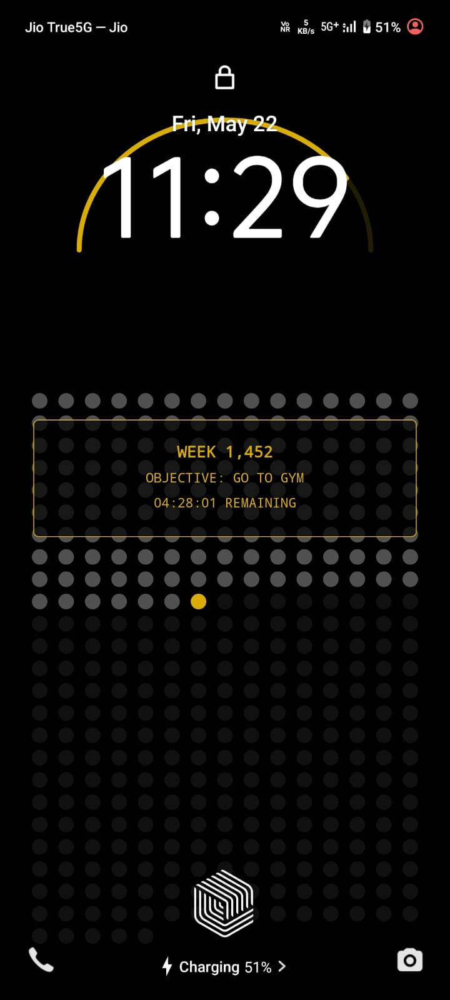
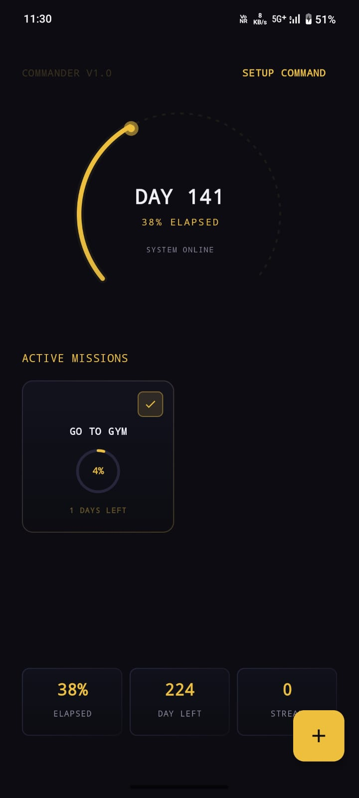
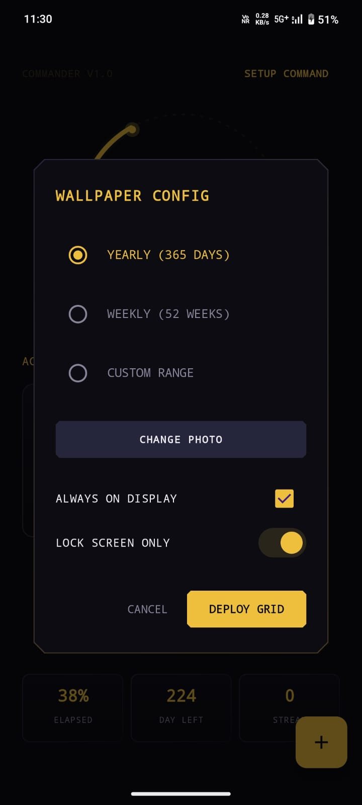

# LifeLayer — Memento Mori Wallpaper & Mission Tracker

> *"Remember you will die. Act accordingly."*

LifeLayer is a tactical Android productivity app that turns your wallpaper into a live accountability system. Every day that passes is a dot gone. Every mission you set has a countdown. The clock doesn't stop — neither should you.

---

## Screenshots and Demo
https://github.com/user-attachments/assets/c23a8471-4da7-4d0a-9f71-93506db7143f

<p align="center">
  
  
  
</p>
---

## Features

### 🎯 Mission System
- **Deploy Missions** — Set goals with a title (up to 40 characters) and a target duration in days
- **Mission Cards** — A 2-column grid shows all active missions with animated circular progress rings
- **Complete Missions** — Mark missions done and trigger a "MISSION ACCOMPLISHED" animation burst on your wallpaper

### 🖼️ Live Wallpaper (Mori Grid)
- **Yearly Mode** — 365 dots, one per day. Elapsed days are lit. Today blinks.
- **Weekly Mode** — 52 dots, one per week of the year
- **Custom Mode** — Set any number of days and a custom start date; track any countdown you want
- **Home Screen Photo** — Set a personal background image with a built-in editor (zoom, drag, dim, Gold HUD / Obsidian tint)
- **Lock Screen Only Mode** — Optionally show the grid only on lock screen
- **Always-On Display (AOD)** — Low-power ambient mode for AMOLED screens

### 📊 At-a-Glance Stats
- Animated arc showing current day progress through the year/period
- Live stats: % elapsed, days/weeks remaining, streak counter

### 🔔 Command Strip (Notification)
- Persistent foreground notification showing active mission + countdown timer
- Color shifts from gold to red as deadline approaches
- Haptic heartbeat alerts in the final hour
- Quick "COMPLETE" action from the notification shade

---

## Tech Stack

| Layer | Technology |
|---|---|
| Language | Kotlin |
| UI Framework | Jetpack Compose + Material 3 |
| Architecture | MVVM (ViewModel + StateFlow) |
| Database | Room (SQLite) |
| Background | Android WallpaperService (Live Wallpaper) |
| Notifications | Foreground Service + NotificationCompat |
| Async | Kotlin Coroutines |
| Min SDK | API 26 (Android 8.0 Oreo) |
| Target SDK | API 35 (Android 15) |

---

## Project Structure

```
app/src/main/java/com/example/lifelayer/
├── MainActivity.kt              # UI — all Composable screens & dialogs
├── data/
│   ├── AppDatabase.kt           # Room database setup
│   ├── MissionDao.kt            # DAO queries
│   ├── MissionEntity.kt         # Room entity (missions table)
│   └── MissionRepository.kt     # Data access layer
├── service/
│   ├── MoriWallpaperService.kt  # Live wallpaper engine (dots + arc + HUD)
│   ├── MissionService.kt        # Foreground notification countdown service
│   └── MissionReceiver.kt       # Broadcast receiver for notification actions
└── ui/
    ├── MainViewModel.kt         # ViewModel — mission deployment & state
    └── theme/
        ├── Color.kt             # CommandGold, OnyxBlack, GhostSlate palette
        ├── Theme.kt             # Dark Material 3 theme
        └── Type.kt              # Typography
```

---

## Getting Started

### Prerequisites
- Android Studio Hedgehog (2023.1.1) or later
- JDK 17
- Android SDK 35

### Build & Run

```bash
git clone https://github.com/Nandan1128/Life_Layer.git
cd Life_Layer
./gradlew assembleDebug
```

Or open in Android Studio and click **Run ▶**.

### Setting Up the Live Wallpaper

1. Open the app
2. Tap **SETUP COMMAND** in the top-right corner
3. Choose a grid mode (Yearly / Weekly / Custom)
4. Optionally pick a home screen photo
5. Tap **DEPLOY GRID** — the system wallpaper picker opens automatically

---

## Design Language

LifeLayer uses a deliberate **tactical command-center** aesthetic:

- **CommandGold** `#D4AF37` — active elements, progress, emphasis
- **OnyxBlack** `#0A0A0F` — background
- **GhostSlate** `#1A1A2E` — card surfaces
- **BloodRed** `#8B0000` — critical state (mission deadline < 1 hour)
- Monospace fonts throughout — precision over decoration
- Cut-corner shapes on dialogs and buttons — angular, purposeful

---

## Roadmap

- [ ] Mission history & analytics
- [ ] Streak tracking (logic wired, UI counter pending)
- [ ] Widget support
- [ ] Notification customization (duration, alert intervals)
- [ ] Multi-mission wallpaper overlay
- [ ] Play Store release

---

## Contributing

Pull requests are welcome. For major changes, open an issue first to discuss what you'd like to change. Please ensure tests pass (`./gradlew test`).

---

*Built with purpose. Every dot is a day. Make them count.*
